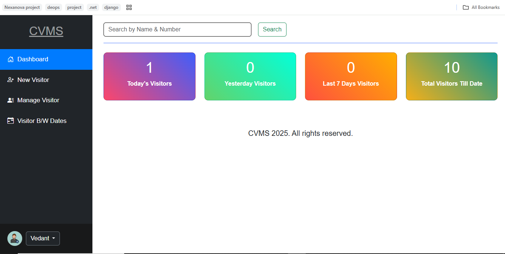
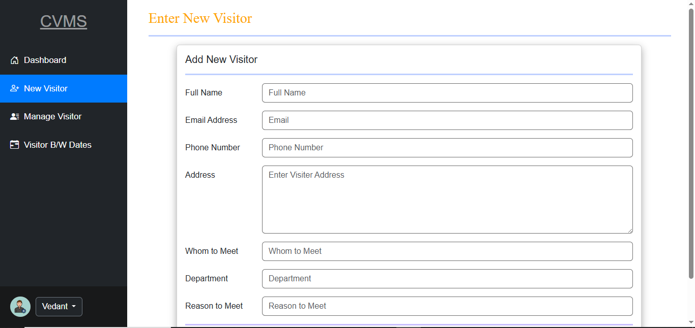
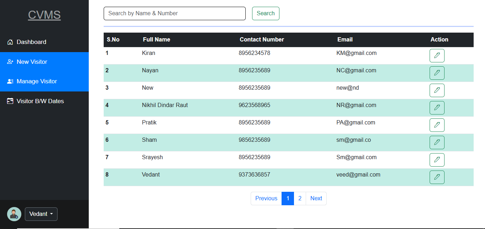

# 🛂 Visitor Management System (CVMS)

A web-based **Visitor Management System** built using **Django**, designed to manage and monitor visitors in an organization. It includes features for adding, searching, updating, and filtering visitor records between dates.

---

## 📌 Features

- 🔐 User authentication
- 🧾 Add new visitors
- 📋 Manage existing visitor records
- 🔍 Search by name or contact number
- 📅 Filter visitors between two dates
- 📊 Pagination support
- 🎨 Clean and responsive UI using Bootstrap 5
- ✅ Flash messages for successful actions
- 🗂 Sidebar navigation for easy access

---

## ⚙️ Tech Stack

| Layer      | Technology                  |
|------------|------------------------------|
| Backend    | Django (Python)              |
| Frontend   | HTML5, CSS3, Bootstrap 5     |
| Icons      | Bootstrap Icons              |
| Database   | SQLite (can be switched to PostgreSQL/MySQL) |

---

## 🚀 Getting Started

### 1. Clone the Repository

```bash
git clone https://github.com/vedantthate/Company-Visitor-Management-System.git
cd Company-Visitor-Management-System-main
```

### 2. Create a Virtual Environment

```bash
python -m venv venv
source venv/bin/activate   # On Windows: venv\Scripts\activate
```

### 3. Install Dependencies

```bash
pip install -r requirements.txt
```

### 4. Apply Migrations

```bash
python manage.py makemigrations
python manage.py migrate
```

### 5. Run the Server

```bash
python manage.py runserver
```

Visit `http://127.0.0.1:8000` to open the app.

---

## 📁 Project Structure

```
Company-Visitor-Management-System/
└── Company-Visitor-Management-System-main/
    ├── .gitignore
    ├── README.md
    ├── manage.py
    ├── requirements.txt
    ├── Company_visiter/
    │   ├── __init__.py
    │   ├── asgi.py
    │   ├── settings.py
    │   ├── urls.py
    │   └── wsgi.py
    ├── app/
    │   ├── __init__.py
    │   ├── admin.py
    │   ├── apps.py
    │   ├── models.py
    │   ├── tests.py
    │   ├── urls.py
    │   ├── views.py
    │   ├── migrations/
    │   └── templates/
    │       ├── dashboard.html
    │       ├── forgetpass.html
    │       ├── login.html
    │       ├── managevisiter.html
    │       ├── newpassword.html
    │       ├── newvisiter.html
    │       ├── profile.html
    │       ├── register.html
    │       ├── update_visiter.html
    │       ├── visiablebydate.html
    │       └── visitbydate.html

```

---

## 🔐 Admin Access

Create a superuser to access Django Admin:

```bash
python manage.py createsuperuser
```

---

## ✍️ Screenshots

### 📊 Dashboard View


### ➕ Add Visitor Form


### 📋 Manage Visitors Table


---

## 💡 Future Enhancements

- Email notification to admin on new visitor
- PDF download/export of visitor logs
- Role-based access (e.g., receptionist, security)
- Integration with RFID or QR scan

---

## 🧑‍💻 Author

- **Vedant Thate**
- GitHub: [@vedantthate](https://github.com/vedantthate)
- Email: vedantthate19@gmail.com
---

## 📄 License

This project is open source under the [MIT License](LICENSE).
